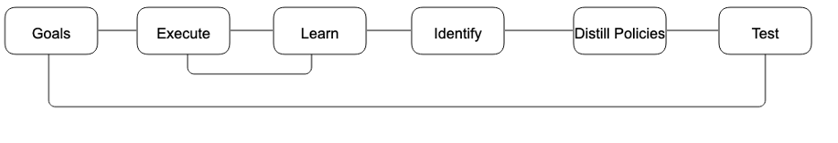
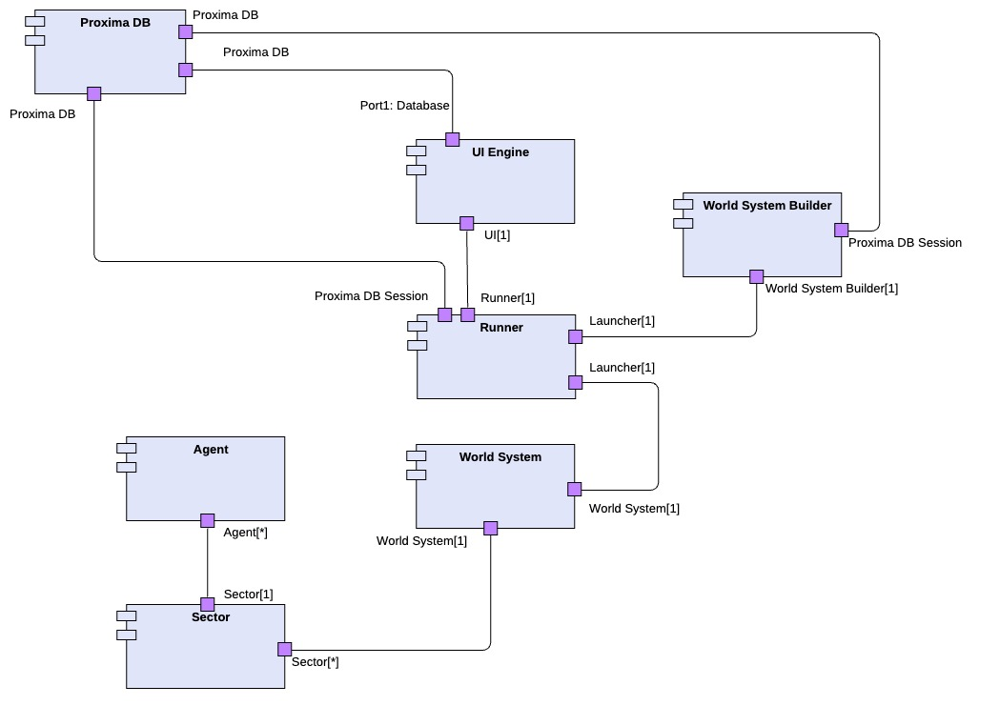
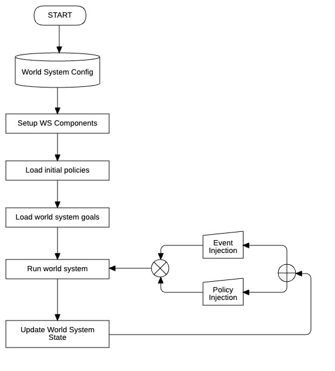

# Problem Background
## Objective
The objective of **World System Beta** is to create a clean-slate base world system that humans are in the process of building on the Moon. It is a perfect test ground to compare against **World System Alpha**, which represents an idealized version of the world system on Earth.  

Throughout the development of World System Beta, the following objectives are to be met:

- Establish the foundation of World System Beta using **Agent-Based Modeling (ABM)** and **Discrete Event Simulations (DES)** to model dynamic interactions, emergent behaviors, and systemic dependencies.
- Validate baseline performance and expose vulnerabilities, using structured experiments to evaluate system behavior under defined policies.
- Optimize internal flows and feedbacks using both system dynamics and learned control models.
- Enable adaptation, resilience, and decentralized intelligence.
- Compare system performance before and after adaptive logic integration.
- Consolidate adaptive and control-informed policies into a reusable governance layer.
- Introduce socio-political dimensions.
- Map how robust adaptive policies are to variable conditions.
- Explore how external policies influence internal system behavior.
- Codify adaptive policies and export them to World System Alpha.

## Constraints
The initial world system Beta is constrained to plans and operations defined as part of Artemis program. This is to provide a controlled environment that has some realistic odds of success.

# Case Studies

This section covers case studies based on real events and historical records on Earth. The goal is to identify major success and failure cases, analyze them, form patterns, and use the results to define a set of goals and policies for World System Beta.  

### Grid Fragility and Cascading Failures
- **2003 Northeast Blackout (USA/Canada):** A single transmission line sag + alarm failure → cascade → 50M people lost power.
- **2021 Texas Winter Storm (ERCOT):** Weather stress + poor infrastructure + no grid interconnection → statewide outage.

### Weather and Climate Vulnerability
- **Hurricane Maria (2017, Puerto Rico):** Centralized infrastructure destroyed → weeks without power.
- **Wildfires in California:** Sparked by grid lines; rolling blackouts implemented to reduce risk.

### Centralization and Monopolization
- Many nations (e.g., South Africa’s **Eskom**) struggle due to centralized, politicized, monopolistic utilities.
- High dependency leads to fragile socio-political links.

### Underinvestment in Storage and Buffering
- Most grids (even advanced ones) underinvest in storage: Germany, USA, Japan.
- Over-reliance on real-time generation leads to waste or shortages.

### Technology Lock-In & Transition Delay
- Fossil fuel investment inertia → slow clean energy adoption despite cost parity.
- Nuclear stagnation due to regulation & public distrust.

### Equity and Access Disparities
- Energy poverty in rural India and sub-Saharan Africa: over 800 million people lack electricity.
- Urban slums often lack reliable energy despite proximity to infrastructure.

# Functional Description
## Simulation Functions and Capabilities

This section defines the simulation’s functional contract—what **Proxima** can do and how it is organized. It specifies core agent behavior (operational modes, task/telemetry interfaces, lifetime and health), describes how parametric world-system goals are injected and updated at runtime, and explains how sectors translate those goals into priority-weighted schedules and assignments under real-world constraints (power, comms, spares, safety). It also outlines closed-loop adaptation (recomputing priorities from observed state and goal deviation) and the provenance requirements for traceability (versioned goals, derived priorities, and scheduling decisions). Detailed algorithms and implementation choices appear in later sections; this section focuses on roles, interfaces, and capabilities.

---

### Core Agent Functions

- **Operational modes:** Each agent implements one or more mutually exclusive operational modes (e.g., idle, active, maintenance, fault-handling). At any time, exactly one mode is active; mode transitions follow defined preconditions and safety checks.  
- **Single-mode execution:** While executing, an agent performs the key function mapped to its current mode. Concurrency within an agent is internal (e.g., monitoring), but external behavior is represented by a single active mode.  
- **Mode control vs. goals:** Agents are goal-agnostic—they do not store or reason about global world-system goals or priorities. Mode changes are commanded by their sector’s scheduler/policy layer, which interprets goals and translates them into local assignments.  
- **Task interface:** Agents receive tasks with inputs, required resources, and acceptance criteria; they return status, outputs, and telemetry (including health and consumption metrics).  
- **Lifetime & health:** Each agent has a lifetime and health state (e.g., age, wear, fault counters). End-of-life or degraded health triggers policy-driven actions (derating, maintenance, swap-out, retirement).  

---

### 1.1.2 Goals Injections and Updates

- **Parametric goals:** World-system goals are expressed in parametric form (metric, target/bounds, horizon, weight), enabling versioning, comparison, and optimization.  
- **External updates:** Authorized external actors (human or supervisory policy engine) may inject new goals or modify existing ones at runtime. All changes are timestamped, versioned, and auditable.  
- **Goal interpretation:** The world system translates global goals into sector-level priority vectors using observed state, constraints, and policy, resolving tradeoffs across sectors.  
- **Scheduling & assignment:** Each sector applies its prioritization and scheduling policies (e.g., priority-weighted scheduling, earliest-deadline-first, resource-aware dispatch) to allocate tasks and set agent modes to meet goals under constraints (power, comms, spares, health).  
- **Closed-loop adaptation:** Sectors periodically recompute priorities based on goal deviation and performance. Policies may adapt automatically (auto-mode) or be updated manually (manual-mode) with immediate effect.  

---

### System Performance Monitoring Against Goals
*(Content TBD)*

---

### Growth
*(Content TBD)*

---

### Policy Injection
- Policy engine and prioritization

---

### Event Scenario Injections
*(Content TBD)*

---

### Advancement

This section defines how the world system progresses through stages using explicit stage profiles (preconditions, postconditions, unlocks, and evaluation rules). Progress is data-driven: if civilization behavior deviates (better or worse), advancement accelerates or slows accordingly.

- **Stage profile:**  
  - *Preconditions:* Required metrics, resource levels, or events to enter.  
  - *Postconditions:* Verification tests to complete.  
  - *Unlocks:* Capabilities/technologies enabled at entry.  
  - *Goals & weights:* (Re)parameterized system goals active during the stage.  
  - *Evaluation metrics:* Positive/negative contribution measures and thresholds.  

- **Advancement logic (high level):**  
  - Compute a progress index from goal attainment and contributions (credits/debits).  
  - When preconditions are satisfied, transition to the next stage.  
  - On transition, apply unlocks, reset/retune goals, and recompute priorities across sectors.  

- **Effects at each new stage:**  
  - Technology unlock: New agents, modes, or processes become available.  
  - Contribution tracking: Positive and negative impacts are logged against stage metrics for audit and learning.  
  - Goal setting: Stage-specific goals (targets, horizons, weights) are activated.  
  - Evaluation: The system scores net progress from tracked contributions toward active goals.  

- **Policy adaptation:**  
  - Model Predictive Control (MPC) or Reinforcement Learning (RL) updates policy parameters to reduce goal deviation under constraints.  
  - Adaptation runs on a defined cadence or at stage gates; changes are versioned and traceable.  

- **Operator overrides:**  
  - Goals and policy parameters can be adjusted from the dashboard; changes are timestamped, versioned, and auditable.  

- **Resume after changes:**  
  - The simulation uses checkpointing. When code, policies, or goals change, it resumes from the latest checkpoint to preserve continuity and enable A/B comparisons.  

---

### Adaptation
*(Content TBD)*


## World System Beta Functions

The World System Beta is expected to perform the following functions throughout different phases of development, in ways that directly support the objectives defined in the problem background.

- **Energy Production:** The model supports energy production through various means.  
- **Store Energy:** The model stores energy in batteries for scenarios when energy needs exceed maximum generation capacity.  
- **ISRU:** The model supports regolith processing and Helium-3 generation, contributing to the economy and growth.  
- **Science:** The model supports the generation of science output using Lunar Terrain Vehicles (LTVs).

## World System Goals and Policy Definitions

This section defines the contract between strategy and execution in Proxima. It specifies how high-level goals are declared, governed, and prioritized, and how policies translate those goals into actionable guidance for sectors and agents. Detailed goals, policies and metrics are defined in \([Goals and Policies Spreadsheet Document](https://docs.google.com/spreadsheets/d/1DJ1qMmEId6VD6TH9aABLoQtjdzCsc1FVIo08yIPi0ic/edit?gid=808380489#gid=808380489)).




Figure 1 Reverse Policy Flow

Proxima adopts a goal-first, policy-from-data loop rather than traditional hand-crafted policy design. We declare high-level goals, run the world system, and let reinforcement learning search the control space to discover policies that meet those goals under constraints. From the resulting trajectories, we perform system identification and policy distillation to extract compact, human-readable policy equations (e.g., parametric rules or MPC-compatible forms), then re-insert and test those policies in simulation for stability, safety, and performance. This approach leverages RL’s ability to find non-obvious strategies in complex, coupled environments, while ending with interpretable, auditable policies suitable for governance and deployment.

Success hinges on good engineering: clear rewards tied to goals (with constraints handled via safe/constrained RL), sufficient exploration, and a high-fidelity simulation with domain randomization to avoid overfitting. Identification should use sparse/structured methods (e.g., SINDy/Koopman/neural ODEs) on well-designed state–action datasets to ensure the extracted equations are identifiable and robust. Policies are then validated via A/B testing, sensitivity analysis, and, where appropriate, MPC wrappers or formal checks. With these guardrails, the reverse pipeline is not only feasible—it gives you adaptive performance with traceable, simplified policies that align with Proxima’s audit and advancement framework.


# Structural Architecture



Figure 2 Proxima Model Component Diagram

## Proxima DB:
Thin MongoDB wrapper that manages configuration/state documents (environments, component templates, world systems, policies, goals, events, experiments) and a time-series simulation log. Provides CRUD helpers, JSON import/export, and a simple CLI for dump/restore.

## Proxima UI Engine
Dash-based dashboard that reads simulation logs, flattens sector metrics for plotting, builds sector summary tables, and sends control commands by inserting into MongoDB command collections.

## World System Builder
Assembles a complete world system configuration from DB documents by resolving templates and composing per-sector agent configs; also loads goals and computes combined sector priorities for downstream scheduling and power allocation.

## World System
Mesa Model orchestrator that initializes sectors, computes goal-weighted allocations, dispatches power/priorities to sectors each step, and aggregates sector metrics into a unified model metrics structure.

## Proxima Runner
Simulation loop controller that builds the config, instantiates World System, runs continuous or limited steps, processes DB-driven commands (startup/runtime), and logs sector metrics plus runner state each step.




Figure 3 Proxima Model Operation Flow

# Dynamical Architecture

## Dynamics

### Agent Evolution with Resource Production and Environmental Side-effects

**ICE Extraction Agents**

```math
X^{(\mathrm{ICE})}_t = A_{\mathrm{ICE}} \, X^{(\mathrm{ICE})}_{t-1} + B_{\mathrm{ICE}} \, P^{(\mathrm{ICE})}_t + C_{\mathrm{ICE}} \, E^{(\mathrm{ICE})}_t
```

Where:

```math
X^{(\mathrm{ICE})}_t =
\begin{bmatrix}
H_2 \\
O_2 \\
E_{\text{dust}} \\
E_{\text{surface}}
\end{bmatrix}
```

**Explanation:**  
- Models **state update** for ICE extraction agents mining lunar ice for hydrogen and oxygen.  
- $A_{\mathrm{ICE}}$: persistence/decay from previous timestep.  
- $B_{\mathrm{ICE}}$: effect of **policies** (extraction rate, dust suppression, energy allocation).  
- $C_{\mathrm{ICE}}$: effect of **external events** (equipment failure, impacts).  
- Tracks both **outputs** (H₂, O₂) and **side-effects** (dust, surface degradation).

---

**Regolith Extraction Agents**

```math
X^{(\mathrm{REG})}_t = A_{\mathrm{REG}} \, X^{(\mathrm{REG})}_{t-1} + B_{\mathrm{REG}} \, P^{(\mathrm{REG})}_t + C_{\mathrm{REG}} \, E^{(\mathrm{REG})}_t
```

Where:

```math
X^{(\mathrm{REG})}_t =
\begin{bmatrix}
\mathrm{He}_3 \\
\mathrm{Metal} \\
E_{\text{dust}} \\
E_{\text{surface}}
\end{bmatrix}
```

**Explanation:**  
- Similar to ICE extraction but for **regolith mining** (producing helium-3 and metals).  
- Includes same **environmental impact tracking** variables for aggregation.

---

### Science Metric as Technology Unlock Driver

```math
S_t = S_{t-1} + \eta_{\mathrm{SCI}} \cdot r_{\mathrm{SCI}}(t) - \delta_{\mathrm{SCI}} \, S_{t-1}
```

Unlock condition:

```math
S_t \geq S_{\mathrm{fusion}} \quad \Rightarrow \quad \text{Fusion technology unlocked}
```

**Explanation:**  
- $S_t$: cumulative science score.  
- $\eta_{\mathrm{SCI}}$: science efficiency per rover-hour/mission.  
- $r_{\mathrm{SCI}}(t)$: science rate at time \(t\).  
- $\delta_{\mathrm{SCI}}$: knowledge decay rate.  
- Crossing $S_{\mathrm{fusion}}$ unlocks helium-3 fusion tech.

---

### World System State Aggregation

```math
X^{(\mathrm{WSB})}_t = \omega_{\mathrm{ICE}} \, X^{(\mathrm{ICE})}_t + \omega_{\mathrm{REG}} \, X^{(\mathrm{REG})}_t + \omega_{\mathrm{SCI}} \, S_t
```

Extension of the manuscript’s:

```math
X^{(\mathrm{WS})}_t = \sum_{i=1}^N \omega_i \, X^{(i)}_t
```

**Explanation:**  
- Aggregates ICE, REG, and SCI states into one composite lunar system state.  
- Weights $\omega$ represent subsystem importance.

---

### Environmental Impact – Lunar Specialization

```math
E^{(\mathrm{Lunar})}_t = \gamma_1 E^{(\mathrm{Lunar})}_{t-1} + \gamma_2 \left( E_{\text{dust}} + E_{\text{surface}} \right) + \gamma_3 N_t - \gamma_4 P_{\mathrm{mitigation},t}
```

**Explanation:**  
- $E^{(\mathrm{Lunar})}_t$: total environmental impact index.  
- $\gamma_1$: persistence of previous damage.  
- $\gamma_2$: impact of dust and surface degradation.  
- $\gamma_3 N_t$: effect of number of active agents/missions.  
- $\gamma_4 P_{\mathrm{mitigation},t}$: mitigation policy effects.

---


## Policies

### Dust Coverage Index - Throttling

[x] TBD

### Manufacturing Sector Priority Management Policy

The Priority-as-Token Deficit Round Robin (DRR) scheduler is used to fairly allocate simulation “turns” among manufacturing tasks based on their assigned priorities. Each task earns tokens at a rate equal to its priority when it is runnable, and only runnable tasks can accumulate tokens (no banking while blocked). At each simulation step, the task with the highest token balance is selected to run, with a round-robin pointer breaking ties. After a task runs and produces work, a fixed number of tokens is spent from its balance. This approach ensures that over time, the share of turns each task receives is proportional to its priority, while still guaranteeing that lower-priority tasks get opportunities to run if they remain available. In our manufacturing sector, this DRR mechanism drives the selection of operational modes for ISRU extractors and generators, balancing He3 production, metal processing, water extraction, regolith mining, and electrolysis according to dynamic mission priorities.

**Sets and variables:**

* t = 0,1,2,... (step index)
* i ∈ 𝒯 = {He3, Metal, Water, Regolith, Electrolysis}
* p_i(t) ≥ 0  (priority = tokens earned per step)
* DC_i(t) ≥ 0 (deficit / token bank)
* A_i(t) ∈ {0,1} (availability)
* s(t) ∈ 𝒯 ∪ {∅} (selected task)
* Y_i(t) ∈ {0,1} (work flag)
* τ > 0 (token cost per turn; typically τ=1)

#### 1) Token Top-Up (No Banking While Blocked)

```math
DC_i^{+}(t) =
\begin{cases}
DC_i(t) + p_i(t), & \text{if } A_i(t)=1 \text{ and } p_i(t) > 0, \\
0, & \text{otherwise}.
\end{cases}
```

**Description:** If a task is runnable (`A_i(t)=1`) and has positive priority, it earns tokens equal to its priority. If it’s blocked or has zero priority, its token balance is reset to 0.

---

#### 2) Candidate Set and Winner (Max-Deficit; RR for Ties)
$$
\mathcal{C}(t) = \{\, i \in \mathcal{T} \mid A_i(t)=1,\ DC_i^{+}(t) > 0 \,\}
$$

$$
DC^\star(t) = \max_{i \in \mathcal{C}(t)} DC_i^{+}(t)
$$

$$
\mathcal{W}(t) = \{\, i \in \mathcal{C}(t) \mid DC_i^{+}(t) \ge DC^\star(t) - \varepsilon \,\}
$$

$$
s(t) \in \mathcal{W}(t) \quad \text{(tie broken by round-robin)}
$$

**Description:** The scheduler selects from runnable tasks with positive tokens. The task(s) with the highest token balance form the winner set, and ties are broken using a round-robin pointer.

---

#### 3) Token Spending (Per Turn, Only If Work Occurred)
$$
DC_{s(t)}(t+1) = \max\left(0,\, DC_{s(t)}^{+}(t) - \tau \cdot Y_{s(t)}(t)\right)
$$

$$
DC_{j \ne s(t)}(t+1) = DC_{j}^{+}(t)
$$

**Description:** If the selected task completed work (`Y_{s(t)}=1`), it spends a fixed number of tokens `τ`. Non-selected tasks keep their updated balances.

---

#### 4) Inactive Shortcut

$$
\sum_{i \in \mathcal{T}} p_i(t) = 0 \ \Longrightarrow\ \text{sector inactive at step } t
$$

**Description:** If all task priorities are zero, the manufacturing sector becomes inactive for that step, and no scheduling occurs.

---

#### 5) Availability Example

$$
A_i(t) = \mathbf{1} \left[ \text{agents}(i) \land \mathbf{x}(t) \ge \mathbf{r}_i \land B(t) > 0 \right]
$$

**Description:** A task is considered available if its agents exist, the current stock `x(t)` meets or exceeds its resource requirements `r_i`, and there is positive power budget `B(t)`.

---

#### 6) Long-Run Fairness

$$
\lim_{T \to \infty} \frac{1}{T} \sum_{t=1}^{T} \mathbf{1}[\,s(t)=i\,]
= \frac{p_i}{\sum_{j \in \mathcal{T}} p_j}
$$

**Description:** Over a long horizon, the proportion of turns assigned to each task converges to its priority share. This ensures fair allocation of simulation time proportional to priorities.


## 6. Proxima Capabilities

### 6.1. Phases

With each phase/component, the world system will have:

1. Define physical architecture
2. Define functions to be performed
3. Perform studies on existing function on Earth  
   a. What is working  
   b. What is not working  
   c. Historical patterns  
   d. Distilled complexity science concepts
4. Define goals against which world system performance will be measured.
5. Define policies based on goals and historical patterns.
6. Define Dynamics of the system
7. Run system identification. Match with world system mathematical models and update. Use Reduced Order Models (ROMs)
8. List all assumptions and simplifications
9. Define measures of performance
10. Define world system characteristics to monitor
11. Perform sensitivity analysis
12. Apply adaptive policy control and re-enforcement learning.

**Phase Goals**

| Phase  | Goal | Status |
| ------ | ---- | ------ |
| Phase 1 | Base infrastructure for simulation and expansion. | ✅ |
| Phase 2 | World system can grow.<br>Stress testing capabilities are in place, including Monte Carlo. Post-processing capabilities are added. Host mongo DB server. Host Proxima UI Engine with mongodb linkage.| 🚧 |
| Phase 3 | Incorporate Econosphere.<br>Add fidelity in environmental effects of operations (this will require deep research). |  |
| Phase 4 | Incorporate Sociosphere |  |
| Phase 5 | Incorporate human psychosis. |  |
| Phase 6 | Incorporate Governance. Consolidate adaptive & control-informed strategies into a governance layer. Formalize learned policies and thresholds.<br>- Fuzzy Logic Systems<br>- Rule-Based Systems with adaptive thresholds<br>- Game Theory + Policy Evaluation |  |
| Phase 7 | World system can advance. |  |
| Phase 8 | Run system identification to fit surrogate models.<br>Translate ABM dynamics to differential equations.<br>Predict future behavior & design model-driven policies. |  |
| Phase 9 | World System can adapt. |  |
| Phase 10 | Cislunar policy definition. Explore how external policy forces (e.g., Earth-based governance) influence the internal dynamics of the World System Beta.<br><br>How centralized mandates affect autonomy<br>- Control-based resistance or adaptation strategies<br>- Energy governance under Earth-imposed restrictions |  |
| Phase 11 | Develop a formal policy framework. Establish robust guidelines for decision-making, decentralized governance, and ethical constraints.<br>- Policy Synthesis Engine: aggregates lessons across phases<br>- Decision Tree Learning: derived from simulation logs<br>- Ethics & Constraint Engines: embed safety boundaries<br>- Policy Provenance Logs: ensure transparency and traceability |  |

---

### 6.2. Data Infrastructure

| Capability | Development Phase | Status |
| ---------- | ----------------- | ------ |
| Mongo DB non-relational database used for defining the world system, configuring the world system, and running different experiments. | Phase 1 | ✅ |
| Logger can save time-series data. | Phase 1 | ✅ |
| Logger can take snapshot of currently running world system state. | Phase 1 | ✅ |
| Logger can store system goals. | Phase 1 | ✅ |
| Logger can store policies. | Phase 1 | ✅ |
| Logger can store disturbance scenarios. |  |  |
| Logger can store world system agents. | Phase 1 | ✅ |
| Logger can store environment. | Phase 1 | ✅ |
| Logger can store world system advancement mission profiles. | |  |
| Logger logs time series data to CSV or HDF5 | Phase 1 | ✅ |
| Logger will save time-series data with skipping steps defined | Phase 1 | ✅ |

---

### 6.3. World System Configurator

| Capability | Development Phase | Status |
| ---------- | ----------------- | ------ |
| Mongo DB non-relational database used for defining the world system, configuring the world system, and running different experiments. | Phase 1 | ✅ |
| Based on introductions of new configuration, the configurator is able to initialize the new changes and allow world system to implement it while running. | Phase 2 | 🚧 |

---

### 6.4. Launcher

| Capability | Development Phase | Status |
| ---------- | ----------------- | ------ |
| Launcher can construct world system | Phase 1 | ✅ |
| Launcher can run data logger | Phase 1 | ✅ |
| Launcher can run User Interface | Phase 1 | ✅ |
| Launcher can run simulation in continuous run mode | Phase 1 | ✅ |
| Launcher can run simulation with time-limit | Phase 1 | ✅ |
| Every time the simulation is paused and resumed, the launcher will start a new CSV file logging (in continuous run mode). | Phase 1 | ✅ |

---

### 6.5. UI Engine

| Capability | Development Phase | Status |
| ---------- | ----------------- | ------ |
| The UI can pause and resume simulation | Phase 1 | ✅ |
| The UI can introduce disturbance events | |  |
| The UI can update goals | |  |
| The UI can update policies | |  |
| The UI can add behavior and events from predefined list of behaviors and events | |  |
| The UI can show live simulation data | Phase 1 | ✅ |
| The UI can show time-series plots | Phase 1 | ✅ |
| The UI can configure which parameters to plot | Phase 1 | ✅ |
| The UI is hosted on Cloud Runner | Phase 2 | 🚧 |

---

### 6.6. Simulation

| Capability | Development Phase | Status |
| ---------- | ----------------- | ------ |
| The simulation can run Monte Carlo | Phase 2 | 🚧 |
| The simulation can run scenario-discovery | |  |
| The simulation can run scenarios (defined in database) | |  |
| The simulation can support stochastic runs | Phase 2| 🚧 |
| The simulation can resume from existing world system state | |  |

---

### 6.7. Policy Engine

| Capability | Development Phase | Status |
| ---------- | ----------------- | ------ |
| Base infrastructure policies for science, energy, and economy. Not closed loop. | Phase 1 | ✅ |
| Growth policities | Phase 2 | 🚧 |
| Bio-Inspired algorithms | |  |

---

### 6.8. Complexity Engine

| Capability | Development Phase | Status |
| ---------- | ----------------- | ------ |
| Chaos Analysis |  |  |
| Lyapunov exponent / bifurcation detection | Phase 2 | 🚧 |
| Sensitivity Analysis | Phase 2 | 🚧 |
| Dynamic policy tuning | |  |
| Structural optimization of world system | |  |

---

### 6.9. Event Engine

| Capability | Development Phase | Status |
| ---------- | ----------------- | ------ |
| *(No entries provided)* | |  |

---

### 6.10. Model

| Capability | Development Phase | Status |
| ---------- | ----------------- | ------ |
| World System Can Expand - | Phase 2 | 🚧 |
| World System Can Import From World System Alpha | Phase 2 | 🚧 |
| World System Has Nuclear Power | Phase 2 | 🚧 |
| World System Has Rockers | Phase 2 | 🚧 |
| World System Has Assembly Robots and 3D Printing Robots | Phase 2 |🚧  |

---

### 6.11. Post Processor

| Capability | Development Phase | Status |
| ---------- | ----------------- | ------ |
| The post processor can analyze simulation logs - Post Processing Infrastructure | Phase 2 | 🚧 |
| The post processor can compute system metrics | |  |
| The post processor can generate summaries and comparative metrics | |  |
| The processor can feed data to complexity engine with derived inputs | Phase 2 | 🚧 |
| The post processor can analyze Monte Carlo runs and generate necessary statistics/plots. (1) Feature Scoring (2) Heat Maps (3) Random Forest Feature Importance (4) Pair Scatter Plots (5) Time Series | Phase 2 | 🚧  |

---

## Appendix A: Tools and Techniques

| Tool | Use Case | 
| ---- | -------- | 
| Mesa 3.0 | | 
| SimPy | | 
| Plotly \| Dash | |
